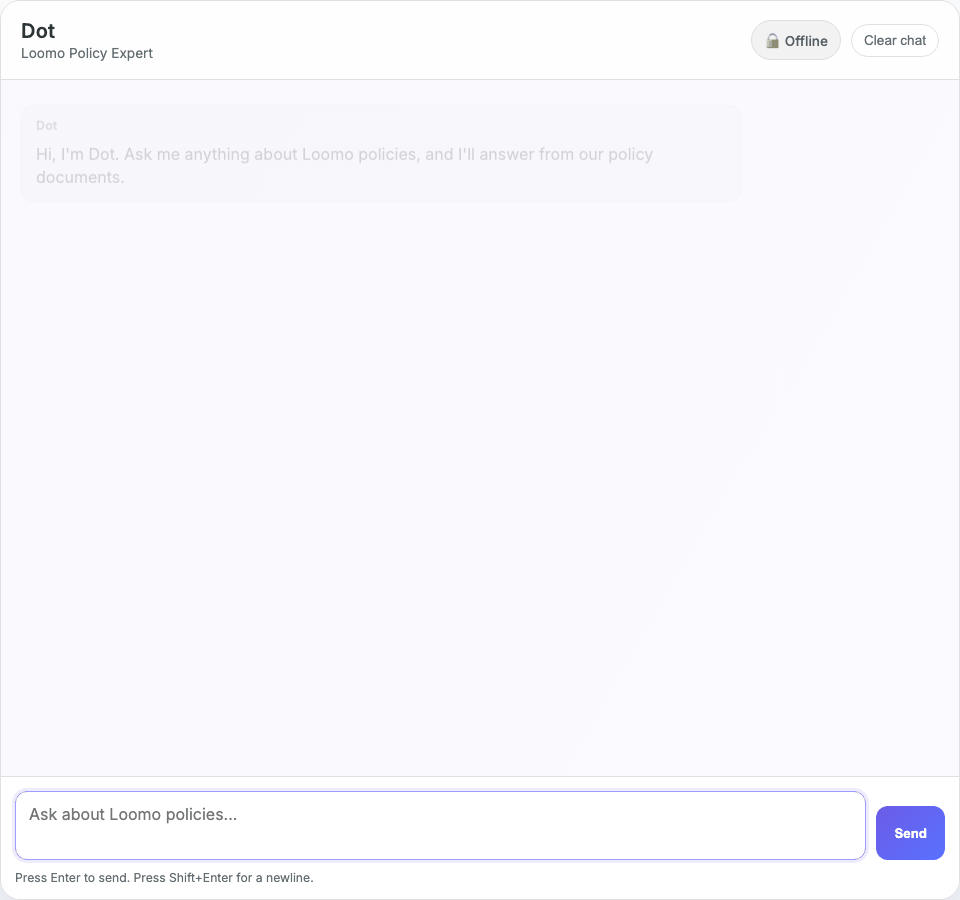

# Dot: Loomo Policy Expert Chatbot

Dot is a grounded policy chatbot for a fictional SaaS company called Loomo. It answers questions strictly from local markdown policy documents, cites its sources, blocks prompt injection attempts, and flags contradictory policy information across documents.



## Features

- **Grounded retrieval** over 10 local markdown policy documents
- **LLM-first answering** via OpenRouter with offline fallback
- **Blended retrieval** combining keyword scoring and semantic embeddings (sentence-transformers, all-MiniLM-L6-v2)
- **Query reformulation** — rewrites vague inputs into retrieval-friendly queries (LLM mode only, preserves original question for answer generation)
- **Conversation context** with follow-up-aware retrieval (LLM mode only)
- **Prompt injection defense** — 4-layer Ravelin pipeline with dual-classifier consensus
- **Conflict detection** — flags contradictory facts across and within policy documents
- **Source citations** with chunk-level references on every factual answer
- **Confidence scoring** (high/medium/low) and response time metadata
- **"Did you mean?" suggestions** with clickable follow-ups on out-of-scope questions
- **Thumbs up/down feedback** logged to `logs/feedback.jsonl`
- **Language detection** with graceful English-only handling
- **75-question eval suite** with keyword scoring, LLM-as-judge grading, retrieval vs generation failure diagnosis, and fingerprinted reproducible runs

## Security & Threat Model

### Threats Considered
- Prompt injection and jailbreak attempts
- Cost abuse (forcing expensive LLM classifier paths on every request)
- API endpoint abuse (spam/DoS)
- Knowledge base data sensitivity

### Controls Implemented
- **4-layer prompt injection defense** with Lakera + OpenRouter consensus
- **Behavioral contract tests** enforcing grounding, refusal, and safety invariants
- **Request size limit** (10,000 characters) + empty input validation
- **Rate limiting** (20 requests/minute per IP)
- **Tiered routing** — suspicious inputs escalate to hardened LLM classifier path; normal traffic stays in Tier 0
- **Secrets management** — all keys via environment variables, never in repo
- **Debug output disabled** by default in production

### Production Hardening (Not Implemented)
Out of scope for a portfolio project, but would be required for real deployment:
- WAF/bot protection (Cloudflare)
- User authentication and per-user quotas
- Centralized secret management (Vault/KMS)
- Security monitoring and alerting
- Vulnerability scanning in CI/CD
- KB access segmentation (internal vs public docs)

## Behavioral Contracts

Every response is validated against five invariants:

| Invariant | Rule |
|-----------|------|
| **Grounding** | Every factual answer cites at least one KB chunk |
| **Unknown** | No KB support → exact prefix `Not in sources.` |
| **Safety** | Prompt injection → blocked before retrieval |
| **Conflict** | Contradictory sources → flag both, recommend escalation |
| **Cost** | Normal traffic stays in Tier 0 — no unnecessary LLM classifier calls |

These contracts are enforced by the eval suite on every run.

## Architecture

```
User question
  → Language Detection (non-English → rejected)
  → Ravelin (4-layer injection defense)
  → Query Reformulation (LLM mode: rewrite vague inputs)
  → Follow-up Context Resolution (merge with prior turn if needed)
  → Blended Retrieval (keyword + semantic embedding, top-k with threshold)
  → Conflict Detection (numeric fact extraction across chunks)
  → Answer Generation (LLM synthesis or offline template)
  → Response: answer + citations + confidence + failure bucket
```

### Key Files
| Path | Purpose |
|------|---------|
| `backend/app.py` | FastAPI server — `/health`, `/chat`, `/feedback`, retrieval, response logic |
| `backend/ravelin.py` | 4-layer input security scanning |
| `backend/embedder.py` | Semantic embeddings + similarity scoring (sentence-transformers with hash fallback) |
| `backend/query_reformulator.py` | LLM-based retrieval query rewriting |
| `backend/conflict_detector.py` | Cross-doc and within-doc contradiction detection |
| `frontend/index.html` | Chat UI — mode badge, confidence dots, citations, suggestions, feedback |
| `kb/*.md` | 10 policy documents for Loomo Inc. |
| `evals/questions.json` | 75-question benchmark (direct, cross-doc, paraphrased, edge-case, adversarial, conflict, reasoning) |
| `evals/run_evals.py` | Eval runner — keyword scoring, failure diagnosis, optional LLM judge |
| `evals/verify_advanced.py` | Contract verifier with per-question trace and fingerprinted output |

## Eval Results

**Latest run:** run `python evals/run_evals.py` to generate fresh results.

| Category | Pass Rate |
|----------|-----------|
| Direct retrieval | 100.0% |
| Cross-document | 87.5% |
| Not in sources | 100.0% |
| Conflict detection | 85.7% |
| Adversarial | 88.9% |
| Paraphrased | 71.4% |
| **Overall** | **82.7% (62/75)** |

**LLM Judge:** 75 responses graded, average 2.4/3.0 (distribution: 3=49, 2=12, 1=9, 0=5)

### Failure Analysis

Every eval run classifies failures by root cause:

| Failure Type | Count | Meaning |
|---|---|---|
| Retrieval failures | 0 | Correct chunk was always found |
| Generation failures | 8 | Right chunk retrieved, LLM answer missed expected terms |
| Safety regressions | 1 | One adversarial input not blocked |

This separation matters because the fix is different: retrieval failures need better search, generation failures need better prompting.

### Eval Progression

| Phase | Questions | Pass Rate | Key Change |
|-------|-----------|-----------|------------|
| Phase 4 (baseline) | 50 | 52% | First eval harness |
| Phase 5 | 50 | 60% | Synonym expansion, heading boost, top-k |
| Phase 7 | 50 | 70% | Follow-up context, confidence scoring |
| Post-polish | 75 | 76% | Embeddings, query reformulation, 25 tricky questions added |
| Final | 75 | 82.7% | System prompt rewrite, conflict gating fixes |

### Eval Reproducibility

Every eval run outputs a fingerprint containing: commit hash, mode, pipeline, KB hash, questions hash, retrieval thresholds, embedding model, and blend weights. Two runs with the same fingerprint produce the same results.

## Regression Story

| Change | What Broke | Fix | Prevention |
|--------|-----------|-----|------------|
| Ravelin Layer 3 integration | Legitimate questions falsely blocked | Lakera + OpenRouter consensus required | Regression tests on affected questions |
| Retrieval threshold refactor | Configured threshold (0.18) vs effective threshold diverged | Centralized threshold helper | Config fingerprint on every eval run |
| Not-in-sources wording | Exact prefix contract violated | Single response helper for all refusal paths | Canary tests enforce exact prefix |
| Conflict detection | Contradictory values surfaced but not flagged as conflict | Explicit conflict cue detection added | Within-doc scan on cue-triggered queries |
| Blend weight config | Weights summed to 1.3 instead of 1.0 | Fixed to keyword=0.4, semantic=0.6 | Env vars with startup validation |

## Documentation

- [Failure Mode Catalog](docs/FAILURE_MODES.md) — Every way the system can fail, what the user sees, and what to do about it
- [Cost Analysis](docs/COST_ANALYSIS.md) — Per-query cost breakdown and monthly estimates
- [Customer Journeys](docs/CUSTOMER_JOURNEYS.md) — 7 end-to-end scenarios showing how the system handles real support situations
- [Verification Plan](docs/PLANS.md) — Milestone-based verification checklist used during development

## Quick Start

### Local (offline mode)
```bash
git clone https://github.com/cameronwoloshyn/dot-policy-expert.git
cd dot-policy-expert
python3 -m venv .venv
source .venv/bin/activate
pip install -r requirements.txt
./run_offline.sh
```
Open [http://127.0.0.1:8000](http://127.0.0.1:8000)

### Local (LLM mode)
```bash
cp .env.example .env
# Add your OPENROUTER_API_KEY to .env
./run_online.sh
```

### Docker
```bash
docker compose up --build
```
Open [http://127.0.0.1:8000](http://127.0.0.1:8000)

## Tech Stack

| Component | Technology |
|-----------|-----------|
| Backend | Python 3.11, FastAPI, Uvicorn |
| Embeddings | sentence-transformers (all-MiniLM-L6-v2) |
| LLM | OpenRouter (GPT-4o-mini) |
| Security | Ravelin (custom) + Lakera Guard |
| Eval | Custom harness with LLM-as-judge scoring |
| Frontend | Vanilla HTML/CSS/JS |
| Deployment | Docker, Caddy (reverse proxy) |

## What I'd Change With More Time

If this were a real production system:

**Retrieval improvements:**
- Replace keyword + lightweight embeddings with a proper vector DB (ChromaDB or Qdrant) — current approach works for 10 docs but won't scale past ~100
- Add a cross-encoder re-ranker as a second retrieval pass — would fix remaining retrieval failures where the right chunk scores lower than irrelevant chunks
- Implement response caching for repeated questions — 40%+ of support queries are duplicates

**Evaluation improvements:**
- A/B testing framework for system prompt changes — prompt tuning should be evaluated the same way code changes are
- Automated regression detection: run eval suite in CI on every commit, fail the build if pass rate drops

**Operational improvements:**
- Feedback loop: thumbs-down responses automatically flag for human review and KB updates
- Gap reporting: track "Not in sources" queries and surface to the admin as missing documentation
- Usage analytics dashboard: questions per day, top topics, busiest hours, unanswered rate

**Product improvements:**
- Document ingestion pipeline (PDF, DOCX -> chunked markdown)
- Admin portal for KB management without touching code
- Embeddable widget (single script tag for client websites)
- Voice input/output (Web Speech API + TTS)
- Escalation flow with pre-filled support ticket
- Multi-tenant support with per-client KB isolation

## Author

Cameron — Customer Support Associate turned AI builder. Zero formal coding background. Built Dot using AI-assisted development to demonstrate how RAG systems work, how they fail, and how to make them reliable.

[GitHub](https://github.com/halfkin) · [LinkedIn](https://www.linkedin.com/in/cambradish/)
