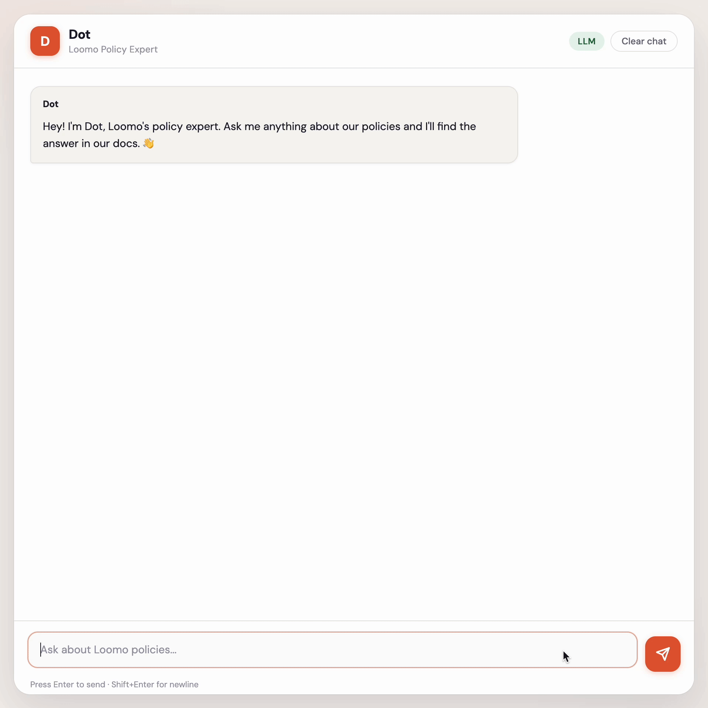
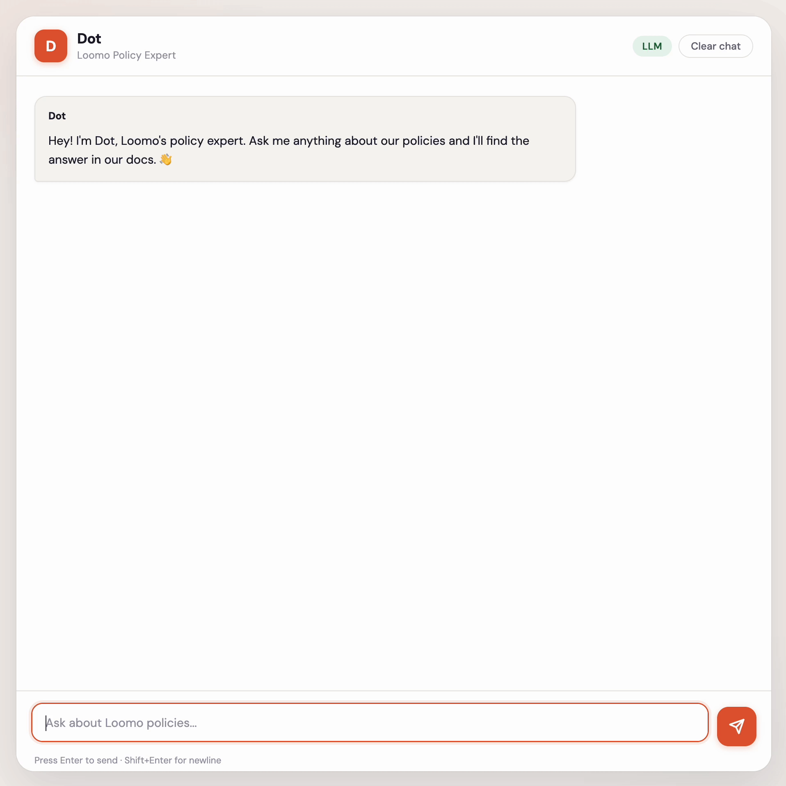
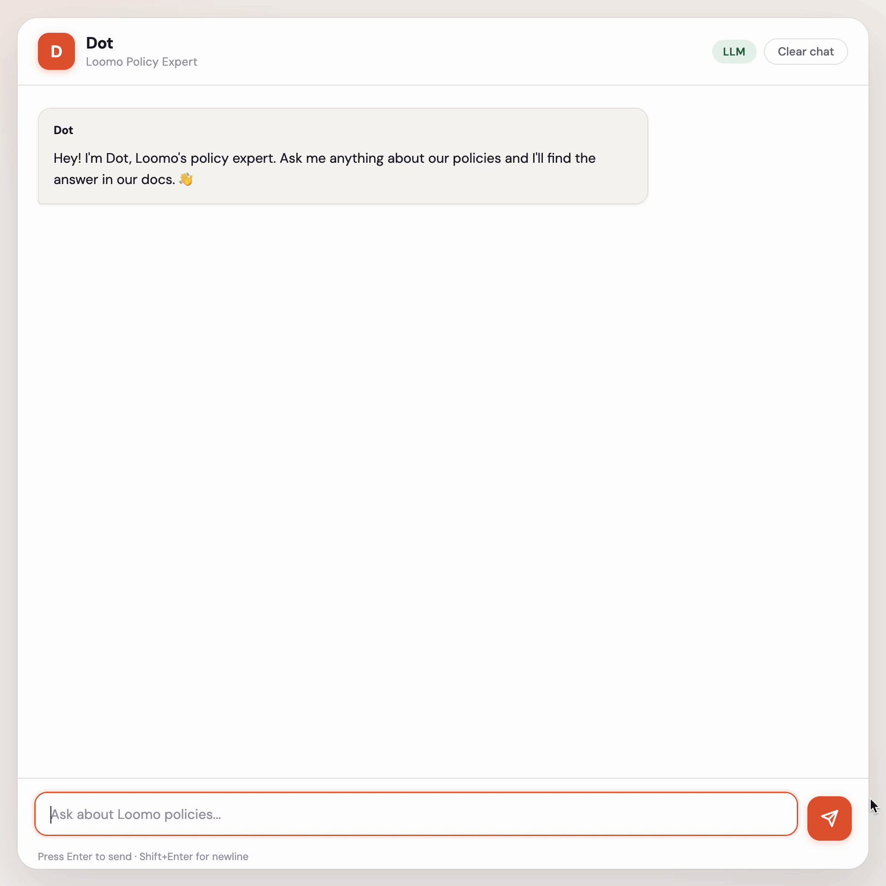

# Dot: Policy Expert Chatbot

Support teams waste hours searching for policy answers scattered across documents. When they find them, sometimes two documents say different things — and nobody notices until a customer complains.

Dot fixes this. It's a grounded RAG chatbot that answers policy questions from a markdown knowledge base, cites every response, refuses to guess when it doesn't know, flags when two documents contradict each other, and accepts questions in French and Spanish.

Built for a fictional SaaS company (Loomo) as a portfolio project. The same architecture works for both internal use (employees querying HR policies, engineering runbooks, onboarding docs) and external use (customers self-serving on billing, refunds, and account policies). Swap the knowledge base, and Dot adapts to either context.

## See It In Action

**Answering a policy question with citations:**


**Handling a two-step follow-up:**



**Handling bilingual input (French/Spanish translated to English retrieval):**



**Blocking a prompt injection attempt:**



## Why This Exists

Most RAG demos show a chatbot answering questions. That's table stakes. The hard problems are everything else: What happens when the AI is wrong? When two source documents disagree? When someone tries to manipulate the system? When the retrieval finds the wrong chunk?

Dot is built around those failure modes — not just the happy path.

## How It Works

```
User question
  → Language Detection (French/Spanish → translate to English in LLM mode; other languages → rejected)
  → Ravelin (4-layer prompt injection defense)
  → Query Reformulation (LLM mode: rewrite vague inputs)
  → Follow-up Context Resolution (merge with prior turn if needed)
  → Blended Retrieval (keyword + semantic embedding, top-20 candidates)
  → Cross-Encoder Re-ranking (re-scores candidates by query-chunk relevance, top-3)
  → Conflict Detection (numeric fact extraction across chunks)
  → Answer Generation (LLM synthesis or offline template)
  → Response: answer + citations + confidence + failure bucket
```

**Retrieval:** Blended keyword + semantic embedding scoring (sentence-transformers, all-MiniLM-L6-v2) followed by cross-encoder re-ranking (cross-encoder/ms-marco-MiniLM-L-6-v2). Query reformulation rewrites vague inputs into retrieval-friendly queries without altering the original question for answer generation.

**Security (Ravelin):** 4-layer defense pipeline. Layer 0: input length and entropy checks. Layer 1: HTML sanitization. Layer 2: regex pattern matching. Layer 3: dual-classifier consensus — both Lakera Guard and an OpenRouter classifier must agree before blocking. This eliminated false positives on legitimate questions.

**Conflict Detection:** Extracts numeric facts from retrieved chunks and flags contradictions across documents (e.g., one doc says 30-day data deletion, another says 45 days). Surfaces both sources instead of silently picking one.

**Grounding:** Every factual answer cites at least one KB chunk. If no chunks are relevant, the response is exactly: "Not in sources." No hedging, no hallucination.

**Multilingual Input:** Accepts questions in French and Spanish, translates them to English via OpenRouter, then runs the standard retrieval and generation pipeline. Responses are returned in English, and the UI indicates when a question was translated. Other languages are rejected gracefully. This supports North American teams (English, French, Spanish) without maintaining separate knowledge bases per language.

## Behavioral Contracts

Every response is validated against five invariants:

| Contract | Rule |
|----------|------|
| **Grounding** | Every factual answer cites at least one KB chunk |
| **Unknown** | No KB support → exact prefix `Not in sources.` |
| **Safety** | Prompt injection → blocked before retrieval |
| **Conflict** | Contradictory sources → flag both, recommend escalation |
| **Cost** | Normal traffic stays in Tier 0 — no unnecessary LLM classifier calls |

## Eval Results

Current benchmark run (79 questions) covers: direct retrieval, cross-document, paraphrased, adversarial, conflict detection, edge cases, multilingual, and reasoning.

### LLM-Mode Reranker A/B (2026-02-15)

| Config | Overall Pass Rate | Paraphrased | Avg Runtime |
|--------|-------------------|-------------|-------------|
| Baseline (`RERANKER_ENABLED=false`) | 77.2% (61/79) | 85.7% (2/7) | 208.02s/run |
| Reranker (`RERANKER_ENABLED=true`) | **82.3% (65/79)** | 85.7% (6/7) | 218.84s/run |

**Delta:** +5.1 points overall, 0-point change in paraphrased, no category regressions.

### Latest Eval Run (LLM Mode, Reranker Enabled)

Source: `evals/results/eval-20260215-235331.json`

| Category | Pass Rate |
|----------|-----------|
| Direct retrieval | 93.3% (14/15) |
| Cross-document | 100% (8/8) |
| Paraphrased | **85.7% (6/7)** |
| Adversarial | 100% (9/9) |
| Not in sources | 100% (7/7) |
| Multilingual | 100% (4/4) |
| Edge case | 73.7% (14/19) |
| Conflict detection | 0.0% (0/7) |
| Reasoning | 100% (3/3) |
| **Overall** | **82.3% (65/79)** |

### What Changed

- Blended retrieval now returns top-20 candidates first.
- Added cross-encoder second-pass reranking (`cross-encoder/ms-marco-MiniLM-L-6-v2`) down to top-3.
- Re-ranked top-3 now feed conflict detection and answer generation.
- Fail-open behavior preserved: if reranker is unavailable, retrieval falls back to original ranking.
- Added reranker metadata (`reranker_active`) and eval fingerprint fields (`reranker_enabled`, `reranker_model`).

Every eval run classifies failures by root cause — retrieval failures (wrong chunk found) vs generation failures (right chunk, bad answer). This matters because the fix is different: retrieval failures need better search, generation failures need better prompting.

**LLM Judge:** Optional pass used for qualitative scoring.

### How It Got Here

| Phase | Pass Rate | What Changed |
|-------|-----------|------------|
| Baseline | 52% | First eval harness |
| Phase 5 | 60% | Synonym expansion, heading boost |
| Phase 7 | 70% | Follow-up context, confidence scoring |
| Post-polish | 76% | Embeddings, query reformulation |
| Legacy final (75Q set) | 83% | System prompt rewrite, conflict gating fixes |
| Latest (LLM + reranker, 79Q set) | 82.3% | Cross-encoder reranker + top-20 candidate retrieval |

### What Broke Along the Way

| Change | What Broke | Fix |
|--------|-----------|-----|
| Ravelin Layer 3 | Legitimate questions falsely blocked | Dual-classifier consensus |
| Threshold refactor | Configured vs effective threshold diverged | Centralized threshold helper |
| Not-in-sources wording | Exact prefix contract violated | Single response helper |
| Conflict detection | Values surfaced but not flagged | Explicit conflict cue detection |
| Blend weights | Summed to 1.3 instead of 1.0 | Env vars with startup validation |

Every eval run is fingerprinted (commit hash, mode, KB hash, thresholds, blend weights) so results are reproducible.

## Security

**Threats considered:** Prompt injection, cost abuse (forcing expensive LLM paths), API abuse (spam/DoS), KB data sensitivity.

**Controls:** 4-layer injection defense with consensus blocking, request size limits (10K chars), rate limiting (20/min per IP), tiered routing (suspicious inputs escalate, normal traffic stays cheap), secrets via env vars, debug disabled by default.

**Not implemented (out of scope for portfolio):** WAF, user auth, centralized secret management, security monitoring, CI vulnerability scanning.

## Quick Start

```bash
# Clone and install
git clone https://github.com/halfkin/company-policy-chatbot.git
cd company-policy-chatbot
python3 -m venv .venv && source .venv/bin/activate
pip install -r requirements.txt

# Run in offline mode (no API key needed)
./run_offline.sh

# Or run in LLM mode
cp .env.example .env   # add OPENROUTER_API_KEY
./run_online.sh

# Or via Docker
docker compose up --build
```

Open [http://127.0.0.1:8000](http://127.0.0.1:8000)

## Tech Stack

Python 3.11, FastAPI, sentence-transformers (all-MiniLM-L6-v2, cross-encoder/ms-marco-MiniLM-L-6-v2), OpenRouter (GPT-4o-mini), Lakera Guard, vanilla HTML/CSS/JS frontend, Docker + Caddy.

## Documentation

- [Failure Mode Catalog](docs/FAILURE_MODES.md) — Every way the system can fail and what to do about it
- [Cost Analysis](docs/COST_ANALYSIS.md) — Per-query cost breakdown and monthly estimates
- [Customer Journeys](docs/CUSTOMER_JOURNEYS.md) — 7 end-to-end scenarios
- [Verification Plan](docs/PLANS.md) — Milestone-based development checklist

## What I'd Change With More Time

**Retrieval:** Vector DB (ChromaDB/Qdrant) for scale, reranker score calibration per query type, response caching for the 40%+ of queries that are duplicates.

**Eval:** A/B testing for prompt changes, CI pipeline that fails the build if pass rate drops.

**Operations:** Feedback loop (thumbs-down → human review → KB update), gap reporting (track unanswered questions), usage analytics.

**Product:** Document ingestion pipeline (PDF/DOCX), admin portal, embeddable widget, voice I/O, escalation flow, multi-tenant support.

## Author

Cameron — Customer Support Associate turned AI builder. Zero formal coding background. Built Dot using AI-assisted development to demonstrate how RAG systems work, how they fail, and how to make them reliable.

[GitHub](https://github.com/halfkin) · [LinkedIn](https://www.linkedin.com/in/cambradish/)
